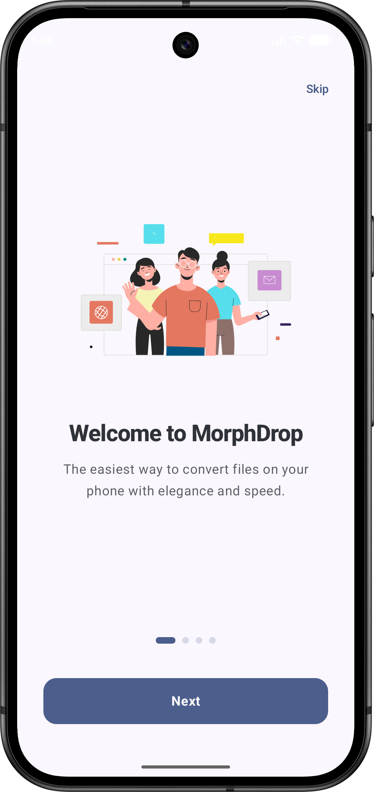
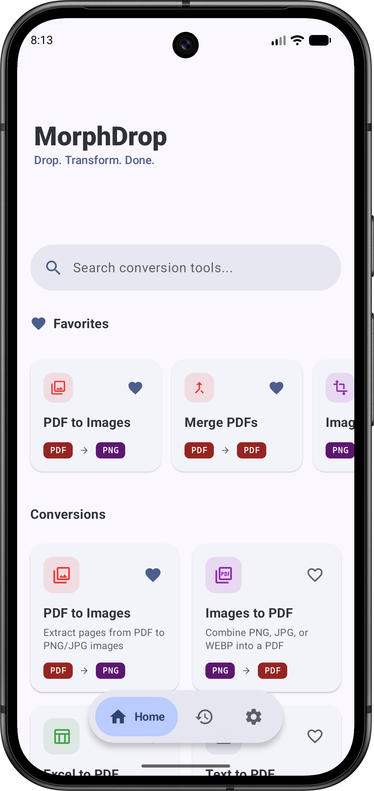
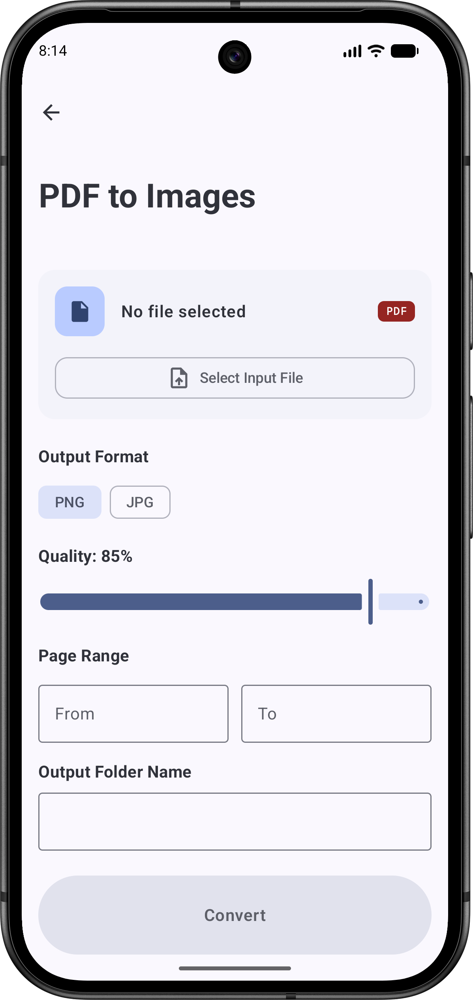
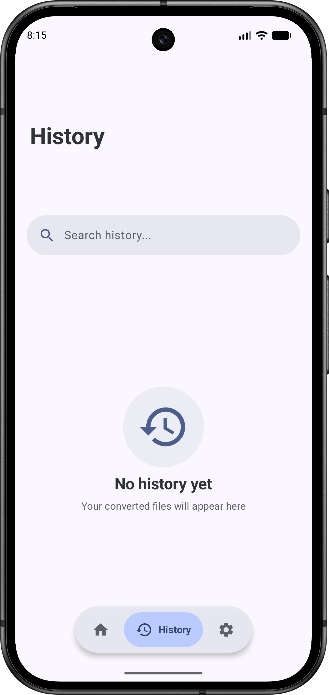
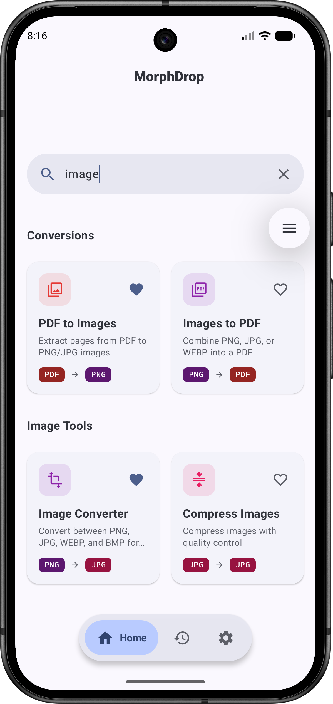
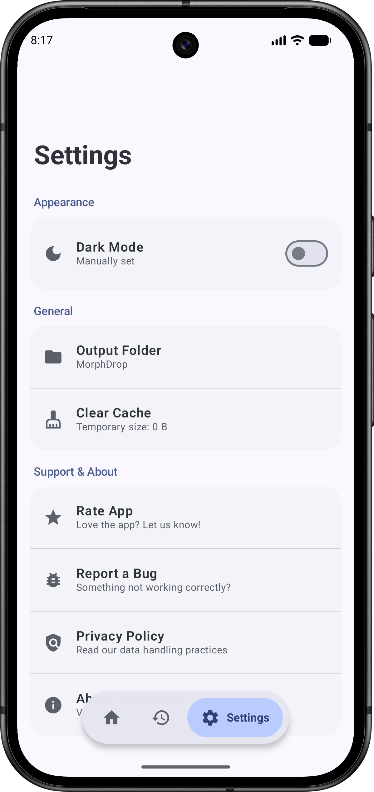

<div align="center">
  <!-- Replace with actual logo path when available -->
  

  <h1>MorphDrop</h1>

  <p><strong>Drop. Transform. Done.</strong></p>
  <p>A modern, 100% offline Android file converter built with privacy and simplicity at its core.</p>
  
  <p>
    <a href="https://github.com/rajendra0309/MorphDrop_Android/releases" style="text-decoration:none;"></a>
    <a href="LICENSE" style="text-decoration:none;"></a>
  </p>
</div>

---

## Overview

**MorphDrop** is an offline-first utility app that allows you to convert documents and images directly on your device. No internet required, no data collection, and no file size limits. It leverages powerful libraries like Apache PDFBox and Apache POI to handle complex file transformations locally and securely, while ensuring a premium user experience with a modern Material 3 design language.

---

## Table of Contents

- [Overview](#overview)
- [Screenshots](#screenshots)
- [Features](#features)
- [Supported Conversions](#supported-conversions)
- [Installation & Setup](#installation--setup)
- [Tech Stack](#tech-stack)
- [Special Thanks](#special-thanks)

---

## Screenshots

<div align="center">
  <table style="margin: 0 auto; border-collapse: collapse;">
    <tr>
      <td align="center" style="padding: 15px; border: none;">
        <b>Welcome Screen</b><br><br>
        
      </td>
      <td align="center" style="padding: 15px; border: none;">
        <b>Home Screen</b><br><br>
        
      </td>
      <td align="center" style="padding: 15px; border: none;">
        <b>Conversion Setup</b><br><br>
        
      </td>
    </tr>
    <tr>
      <td align="center" style="padding: 15px; border: none;">
        <b>History Screen</b><br><br>
        
      </td>
      <td align="center" style="padding: 15px; border: none;">
        <b>Search & Filter</b><br><br>
        
      </td>
      <td align="center" style="padding: 15px; border: none;">
        <b>Settings & Themes</b><br><br>
        
      </td>
    </tr>
  </table>
</div>

---

## Features

### What's New

> - **Material You Aesthetic** — Beautiful modern UI with dynamic theming.
> - **Cooperative Background Tasks** — Safe cancellations without orphaned or corrupted files.
> - **Search FAB System** — Quick and intuitive search functionality integrated tightly into the navigation.
> - **Dynamic Material You Colors** — Blends seamlessly with your device’s wallpaper.

<br>

<details>
<summary><b>Core & Privacy</b></summary>
<br>

- **100% Offline** — Zero internet permissions required. Files never leave your device.
- **Privacy-First** — No data collection and absolutely no analytics tracking.
- **No Size Limits** — Convert large documents locally (subject to device hardware).

</details>

<details>
<summary><b>File Management</b></summary>
<br>

- **Organized Storage** — Converted files are safely stored in your device's `Downloads/MorphDrop` directory.
- **Background Processing** — Conversions run reliably in the background using `WorkManager`.
- **History Tracker** — Keep a persistent record of all your past conversions.

</details>

<details>
<summary><b>Advanced PDF Tools</b></summary>
<br>

- **Merge & Split** — Combine multiple PDFs or extract specific pages.
- **Compress & Optimize** — Reduce PDF file sizes for easy sharing.
- **Rotate & Reorder** — Change page orientation and move pages around.
- **Password Protection** — Lock sensitive PDFs.

</details>

<details>
<summary><b>Customization & UI</b></summary>
<br>

- **Modern Jetpack Compose UI** — Clean, performant, and fast navigation.
- **System Theme Sync** — Smooth transitioning between Light and Dark mode.
- **Floating Navigation Pill** — Premium bottom navigation component.

</details>

---

## Supported Conversions

<details>
<summary><b>Document Conversions</b></summary>
<br>

| From | To |
| :--- | :--- |
| PDF | Images (PNG, JPG) |
| Images (PNG, JPG, WebP, BMP) | PDF |
| Word (DOCX) | PDF |
| PDF | Word (DOCX) |
| PowerPoint (PPTX) | PDF |
| Excel (XLSX) | PDF |

</details>

<details>
<summary><b>Image Conversions</b></summary>
<br>

| From | To |
| :--- | :--- |
| PNG | JPG, WebP, BMP |
| JPG | PNG, WebP, BMP |
| WebP | PNG, JPG, BMP |
| BMP | PNG, JPG, WebP |

</details>

---

## Installation & Setup

### Prerequisites
- Android Studio Ladybug (2024.2) or newer
- JDK 17+
- Android Device/Emulator (API 26+)

### Building from Source

1. **Clone the Repository**
   ```bash
   git clone https://github.com/Rajendra0309/morphdrop-android.git
   cd morphdrop-android
   ```

2. **Open in Android Studio**
   Sync the project with Gradle files.

3. **Build the Application**
   ```bash
   ./gradlew assembleDebug
   ```
4. **Install** the debug APK on your device or emulator.

---

## Tech Stack

| Layer | Technology |
| :--- | :--- |
| **UI** | Jetpack Compose + Material 3 (Material You) |
| **Language** | Kotlin 2.0.x |
| **Architecture** | MVVM + Clean Architecture |
| **DI** | Hilt (Dagger Hilt) |
| **Database** | Room (Local History & Favorites) |
| **Background** | WorkManager |
| **PDF Engine** | Apache PDFBox Android |
| **Office Docs** | Apache POI |
| **Image Proc** | Coil + Android Bitmap API |

---


## Special Thanks

MorphDrop stands on the shoulders of several excellent open-source projects. Sincere thanks to:

| Project | Description |
| :--- | :--- |
| **[Apache PDFBox](https://pdfbox.apache.org/)** | Core engine for PDF manipulation and processing. |
| **[Apache POI](https://poi.apache.org/)** | Robust engine for parsing and transforming Microsoft Office formats (Word, PowerPoint, Excel). |
| **[Jetpack Compose](https://developer.android.com/compose)** | Modern UI toolkit allowing a beautiful, responsive design. |

---

<div align="center">
  <p>Licensed under <a href="LICENSE">Apache License 2.0</a></p>
</div>