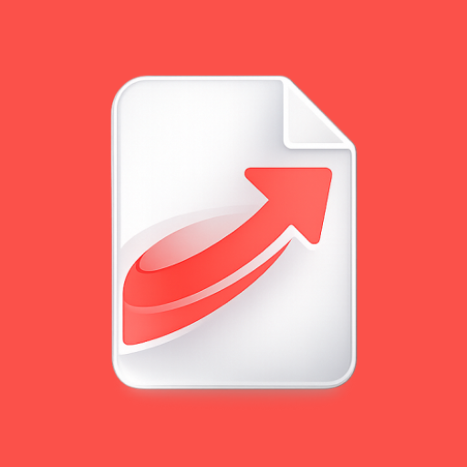

<div align="center">
  

  <h1>MorphDrop</h1>

  <p><strong>Drop. Transform. Done.</strong></p>
  <p>A modern, 100% offline Android file converter built with privacy and simplicity at its core.</p>
  
  <p>
    <a href="https://github.com/Rajendra0309/morphdrop-android/releases" style="text-decoration:none;"></a>
    <a href="LICENSE" style="text-decoration:none;"></a>
  </p>
</div>

---

## Overview

**MorphDrop** is an offline-first utility app that allows you to convert documents and images directly on your device. No internet required, no data collection, and no file size limits. It leverages powerful libraries like Apache PDFBox and Apache POI to handle complex file transformations locally and securely, while ensuring a premium user experience with a modern Material 3 design language.

---

## Table of Contents

- [Overview](#overview)
- [Screenshots](#screenshots)
- [Features](#features)
- [Supported Conversions](#supported-conversions)
- [Installation & Setup](#installation--setup)
- [Tech Stack](#tech-stack)
- [Special Thanks](#special-thanks)

---

## Screenshots

<div align="center">
  <table style="margin: 0 auto; border-collapse: collapse;">
    <tr>
      <td align="center" style="padding: 15px; border: none;">
        <b>Welcome Screen</b><br><br>
        
      </td>
      <td align="center" style="padding: 15px; border: none;">
        <b>Home Screen</b><br><br>
        
      </td>
      <td align="center" style="padding: 15px; border: none;">
        <b>Conversion Setup</b><br><br>
        
      </td>
    </tr>
    <tr>
      <td align="center" style="padding: 15px; border: none;">
        <b>History Screen</b><br><br>
        
      </td>
      <td align="center" style="padding: 15px; border: none;">
        <b>Search & Filter</b><br><br>
        
      </td>
      <td align="center" style="padding: 15px; border: none;">
        <b>Settings & Themes</b><br><br>
        
      </td>
    </tr>
  </table>
</div>

---

## Features

### What's New (v1.4.0)

> - **Home Screen Widgets (Glance Suite)** — 3 responsive, battery-friendly Material 3 widgets for quick actions, recent files, and conversion history with light/dark theme sync.
> - **Batch OCR Processing** — Extract text from multiple images, receipts, or documents in one go with combined or individual views and export options.
> - **Native Markdown Viewer & Editor** — Read and edit `.md` documents with live preview, syntax highlighting, formatting toolbar, auto-indent, and word counter.
> - **Batch PDF Operations** — Apply compression, watermarking, page numbers, passwords, rotation, and merging across multiple PDFs simultaneously with WorkManager foreground notifications.
> - **Professional PDF Tools** — Dedicated single-file tools for custom watermarking, page numbering (6 positions, customizable formatting), and target-size heuristic compression.
> - **Launcher App Shortcuts** — Long-press the app icon to access Convert PDF, Convert Image, History, and Settings with crisp white squircle cards and colored glyphs.
> - **Redesigned In-App Updater** — Modern Material 3 update dialog with progress tracking, formatted release notes, and error retry state.

<br>

<details>
<summary><b>Home Screen Widgets & Quick Actions</b></summary>
<br>

- **Glance AppWidget Suite** — Choose between Combined (Actions + History), Quick Tools (Launchpad), or Conversion History widgets.
- **Event-Driven Sync** — Instant widget updates whenever conversions finish, with zero periodic wakeups for maximum battery life.
- **Launcher Shortcuts** — Quick static actions available directly from your home screen launcher.

</details>

<details>
<summary><b>Document & Markdown Tools</b></summary>
<br>

- **Markdown Viewer** — Clean reader for `.md` files with formatted tables, code blocks, and system-wide "Open With" integration.
- **Markdown Editor** — Split-pane or full-screen editor with debounced live preview, formatting toolbar, and keyboard shortcuts.
- **Text to PDF** — Convert plain text files into cleanly formatted PDF documents.

</details>

<details>
<summary><b>Batch PDF & Advanced Tools</b></summary>
<br>

- **Batch Operations** — Multi-file processing for compress, watermark, page numbers, password protection, rotate, and merge.
- **Watermark Tool** — Stamp custom text or image watermarks with adjustable opacity, angle, and position.
- **Page Numbers** — Add customizable page numbers with multiple formats, positions, and cover page skip.
- **Target Size Compression** — Smart heuristic image downsampling to compress PDFs to exact target sizes (e.g., 2MB, 5MB).

</details>

<details>
<summary><b>Privacy & Security Tools</b></summary>
<br>

- **Metadata Inspector** — View hidden EXIF and GPS data in photos and documents.
- **Metadata Scrubber** — Remove all tracking data with a single tap for secure sharing.
- **Metadata Editor** — Modify dates, locations, and author info to protect your identity.
- **PDF Encryption** — Add or remove passwords and permissions on PDF documents.

</details>

<details>
<summary><b>Image & Text Utilities</b></summary>
<br>

- **On-Device OCR** — Extract selectable text from single images or batch process multiple scans offline using Google ML Kit.
- **Image Converter** — Convert between PNG, JPG, WebP, and BMP formats with quality controls.
- **Batch Processing** — Convert hundreds of images simultaneously into organized folders.
- **Interactive Cropping** — Crop and rotate images directly inside the workbench before saving.

</details>

<details>
<summary><b>Core & Architecture</b></summary>
<br>

- **100% Offline** — Zero internet permissions required for conversions. Files never leave your device.
- **In-App Updater** — Seamlessly check and download latest releases directly from GitHub.
- **Privacy-First** — No data collection and absolutely no analytics tracking.
- **Background Processing** — Long-running conversions run reliably in the background via `WorkManager`.
- **History Tracker** — Persistent record of past conversions with matched tool icons and output shortcuts.

</details>

---

## Supported Conversions

<details>
<summary><b>Document Conversions</b></summary>
<br>

| From | To |
| :--- | :--- |
| PDF | Images (PNG, JPG) |
| Images (PNG, JPG, WebP, BMP) | PDF |
| Excel (XLSX) | PDF |
| Text (TXT) | PDF |
| Markdown (MD) | PDF |
| Image / Scanned Document | Selectable Text (OCR / Batch OCR) |
| Multiple PDFs | Batch Compressed, Watermarked, Numbered, Encrypted, Rotated, Merged |

</details>

<details>
<summary><b>Image Conversions</b></summary>
<br>

| From | To |
| :--- | :--- |
| PNG | JPG, WebP, BMP |
| JPG | PNG, WebP, BMP |
| WebP | PNG, JPG, BMP |
| BMP | PNG, JPG, WebP |

</details>

---

## Installation & Setup

### Prerequisites
- Android Studio Ladybug (2024.2) or newer
- JDK 17+
- Android Device/Emulator (API 26+)

### Building from Source

1. **Clone the Repository**
   ```bash
   git clone https://github.com/Rajendra0309/morphdrop-android.git
   cd morphdrop-android
   ```

2. **Open in Android Studio**
   Sync the project with Gradle files.

3. **Build the Application**
   ```bash
   ./gradlew assembleDebug
   ```
4. **Install** the debug APK on your device or emulator.

---

## Tech Stack

| Layer | Technology |
| :--- | :--- |
| **UI** | Jetpack Compose + Material 3 (Material You) |
| **Home Widgets** | Jetpack Glance AppWidget API |
| **Markdown** | Markwon + Prism4j Syntax Highlighting |
| **OCR Engine** | Google ML Kit Text Recognition |
| **Language** | Kotlin 2.0.x |
| **Architecture** | MVVM + Clean Architecture |
| **DI** | Hilt (Dagger Hilt) |
| **Database** | Room (Local History & Favorites) |
| **Background** | WorkManager (Foreground Service Support) |
| **PDF Engine** | Apache PDFBox Android |
| **Office Docs** | Apache POI |
| **Image Proc** | Coil + Android Bitmap API |

---


## Special Thanks

MorphDrop stands on the shoulders of several excellent open-source projects. Sincere thanks to:

| Project | Description |
| :--- | :--- |
| **[Apache PDFBox](https://pdfbox.apache.org/)** | Core engine for PDF manipulation and processing. |
| **[Apache POI](https://poi.apache.org/)** | Robust engine for parsing and transforming Excel formats. |
| **[Jetpack Compose](https://developer.android.com/compose)** | Modern UI toolkit allowing a beautiful, responsive design. |

---

<div align="center">
  <p>Licensed under <a href="LICENSE">Apache License 2.0</a></p>
</div>
